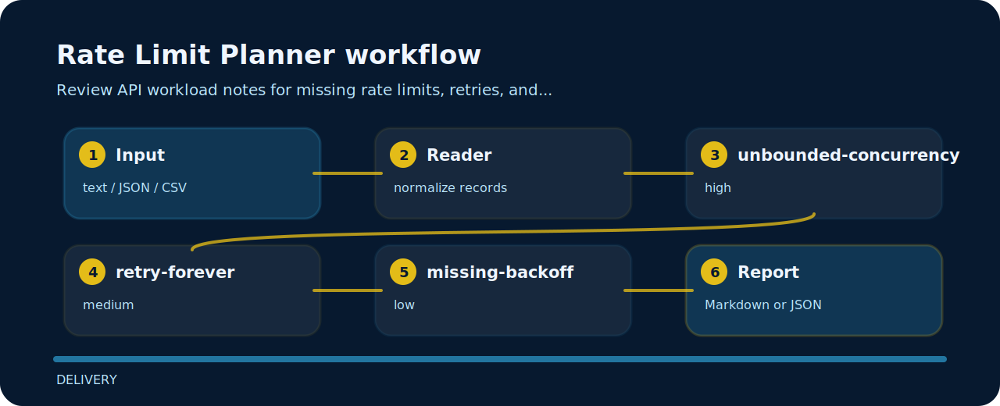

# Rate Limit Planner

This repository turns a tiny plain text into reviewable signals for rate limits.


## Signals

- `unbounded-concurrency` - concurrency is unbounded (high); Set max concurrency and queue behavior..
- `retry-forever` - retry policy is unbounded (medium); Use bounded retries with jitter..
- `missing-backoff` - backoff is missing (low); Add exponential backoff and retry-after handling..

## Signal route



## Command path

```bash
git clone https://github.com/mertefekurt/rate-limit-planner.git
cd rate-limit-planner
python -m pip install -e ".[dev]"
rate-limit-planner examples/sample.txt
```

## Before a release

```bash
ruff check .
pytest
python -m rate_limit_planner --help
```
