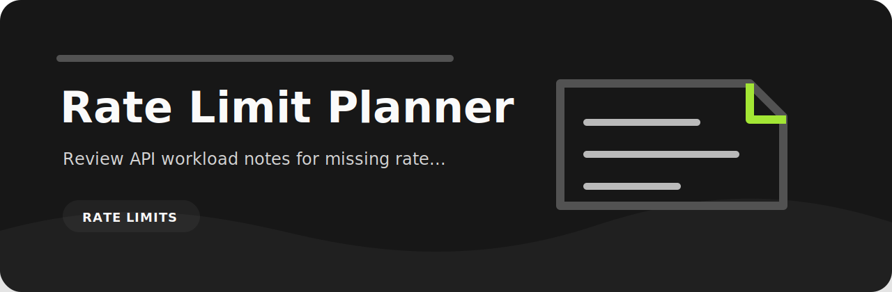

# Rate Limit Planner



> Review API workload notes for missing rate limits, retries, and backoff

   

## At a glance

| Area | Detail |
| --- | --- |
| Focus | rate limits |
| Command | `rate-limit-planner` |
| Formats | text, JSON, JSONL, CSV |
| Output | Markdown table or JSON |

## What it checks

| Rule | Severity | What it catches |
| --- | --- | --- |
| `unbounded-concurrency` | high | concurrency is unbounded |
| `retry-forever` | medium | retry policy is unbounded |
| `missing-backoff` | low | backoff is missing |

## Try it locally

```bash
python -m pip install -e ".[dev]"
rate-limit-planner examples/sample.txt
rate-limit-planner examples/sample.txt --json --fail-on medium
```

## Notes from the code

`rules.py` keeps the project policy explicit, while `core.py` handles parsing and report rendering. The CLI stays thin on purpose so the checks are easy to test.

## Verify

```bash
python -m pip install -e ".[dev]"
ruff check .
pytest
python -m rate_limit_planner --help
```
